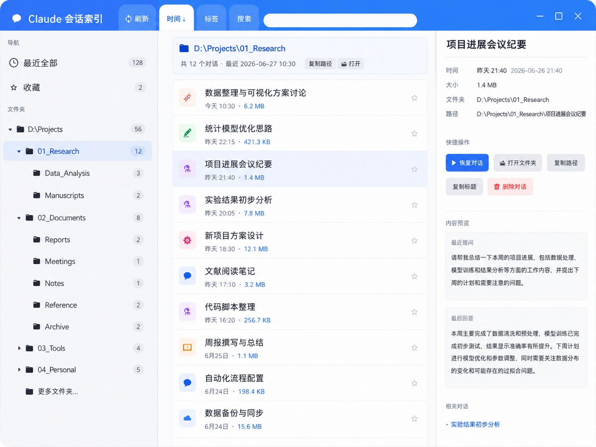
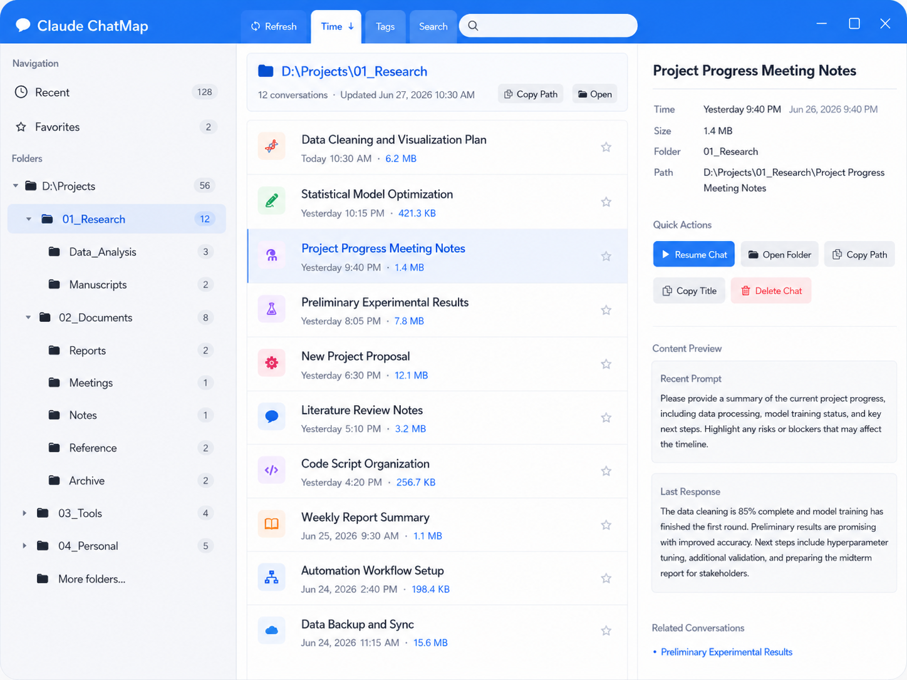
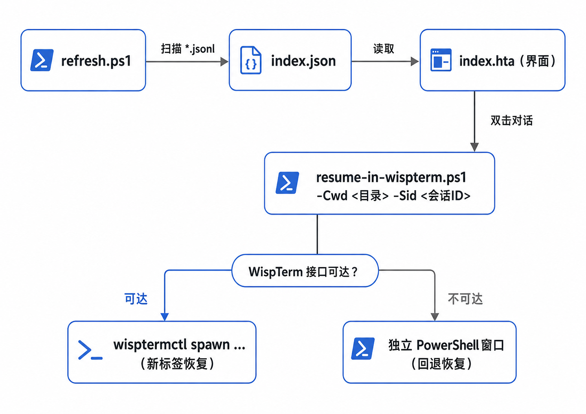

# Claude 会话索引 · Claude ChatMap

[](README.md) [](README.en.md)

一个纯本地、零依赖的 **Claude Code 对话管理面板**。扫描本机所有会话,按文件夹分组,显示标题/时间/大小、内容预览,可收藏/删除,**双击即可在正在运行的 WispTerm 里新开标签 `claude -r` 恢复那次对话**。只用 Windows 自带的 `mshta` + PowerShell,免安装、不联网。

---

> 还在满屏文件夹里翻找上次那个对话开在哪儿?
> 还在重新敲一长串项目路径、再 `/resume` 翻半天选择器才能接上?
> 还在不知道哪个对话已经"养"得巨大、悄悄吃掉你的额度?
> —— **这些,一个面板全解决。**

- 🗺 **一眼定位** — 所有对话按"开在哪个文件夹"自动分组成树,哪次聊在哪个项目一目了然,不用再大海捞针。
- ⚡ **双击即续** — 看中哪条,双击就在 WispTerm 新标签里自动 `cd` 进目录、直接恢复:**不用敲路径、不用点 resume、不用翻选择器**(没装 WispTerm 自动回退普通 PowerShell)。
- 📦 **大小看得见** — 每个对话直接标出体积 (KB/MB),哪个对话"超重"、悄悄吃额度,一眼看穿。
- 🔍 **找得到** — 标题/路径/日期搜索 + 内容预览(最近提问 & 最后回复),不打开就知道是哪次聊的什么。
- ⭐ **收藏 & 管理** — 常用一键收藏,过时右键删除;中英文一键切换。

---

## 截图

左侧文件夹树 · 中间对话列表 · 右侧详情面板 · 一键中英文切换。





---

## 功能

- 🗂 **文件夹树**:按真实路径层级列出有对话的文件夹(大小写自动合并,按最近使用排序)。
- 📋 **对话列表**:彩色图标 + 标题 + 相对时间 + **会话大小(MB)** + 所在文件夹。
- ⭐ **收藏**:点星收藏,集中查看。
- 🔍 **搜索**:纯文字,或 `folder:` / `date:` / `after:` / `before:` 语法,关键词高亮。
- 📄 **详情面板**(单击):完整标题/时间/大小/路径、内容预览(最近提问 + 最后回复)、同文件夹相关对话、快捷操作。
- ▶ **一键恢复**:**双击**对话 → 在运行中的 WispTerm 新开标签、cd 进项目目录、`claude -r <id>` 恢复(WispTerm 没开则回退到独立 PowerShell 窗口)。
- 🗑 **删除**:把会话 `.jsonl` 移到 `deleted/`(从 Claude 移除,可找回)。
- 🪟 无边框窗口 + Win11 圆角/投影 + 紧凑/舒适密度 + 设置记忆 + **中英文一键切换**。

---

## 环境要求

- Windows 10/11(自带 `mshta.exe` 与 PowerShell)。
- 已安装 [Claude Code](https://claude.com/claude-code)(`claude` 在 PATH 中)。
- 会话记录默认在 `%USERPROFILE%\.claude\projects\`(脚本会自动探测;也可用环境变量 `CLAUDE_PROJECTS_DIR` 指定)。
- **(可选,用于在 WispTerm 内恢复)** [WispTerm](https://github.com/xuzhougeng/wispterm) **v1.30.1+** 及其 `wisptermctl` 客户端。

---

## 快速开始

1. 下载/克隆本仓库到任意目录(整个文件夹放哪都行,路径自适应)。
2. 双击 `index.hta` 打开界面。**每次打开会自动刷新一次**(先用上次数据秒显,随后重扫 `*.jsonl` 更新);也可随时点顶部「🔄 刷新」手动重扫。
3. 单击对话看详情;**双击**恢复对话。

> 仅"刷新 + 浏览 + 详情"功能,不需要 WispTerm,开箱即用。想要"双击在 WispTerm 内恢复",见下一节。

---

## 与 WispTerm 结合 / 如何连接

恢复对话默认会**优先落进正在运行的 WispTerm 新标签**;连接靠 WispTerm 的 `wisptermctl` 控制接口。三步打通:

### 1) 装好 WispTerm v1.30.1+ 并放入 wisptermctl
- WispTerm:<https://github.com/xuzhougeng/wispterm>(需 **v1.30.1 及以上**;`spawn` 命令在 v1.30.0 引入、agent-control 应答在 v1.30.1 修复)。
- 从 WispTerm 取到对应平台的 `wisptermctl`(Windows 为 `wisptermctl.exe`),放到**本仓库目录里**(与 `index.hta` 同级)。本仓库不附带该二进制。

### 2) 打开 WispTerm 的控制接口
编辑 WispTerm 配置 `%APPDATA%\wispterm\config`,加入一行:
```
agent-control-enabled = true
```
然后**重启 WispTerm** 生效。验证(任意标签里):
```
wisptermctl.exe panes
```
能返回一段 JSON(标签列表)即代表接口已通。

### 3) 直接用
在「Claude 会话索引」里**双击**任意对话,即会:
```
wisptermctl spawn --cwd <项目目录> -- powershell -NoProfile -NoExit -Command "Set-Location <项目目录>; claude -r <会话ID>"
```
= 在运行中的 WispTerm 新开一个标签、进入该项目目录、`claude -r` 恢复该对话。

> 若 WispTerm 未运行或接口未启用,会**自动回退**到弹出一个独立 PowerShell 窗口执行同样的 `claude -r`,功能不受影响。

---

## 文件结构

| 文件 | 作用 |
|---|---|
| `index.hta` | 主界面(双击打开;路径自适应,定位同目录其他文件)。 |
| `refresh.ps1` | 扫描 Claude 会话(`*.jsonl`)→ 生成 `index.json`;自动探测 projects 目录。 |
| `resume-in-wispterm.ps1` | 恢复对话:WispTerm 新标签 `claude -r`,失败回退独立 PowerShell。 |
| `delete-conv.ps1` | 删除:把会话 `.jsonl` 移到 `deleted/`。 |
| `style-window.ps1` | 给无边框窗口加 Win11 圆角 + 投影(DWM/Win32)。 |
| `winmin.ps1` | 最小化无边框窗口(Win32 ShowWindow)。 |
| `index.json` | 扫描生成的数据(**本地生成,已 gitignore**)。 |
| `settings.json` | 界面设置/收藏(**本地生成,已 gitignore**)。 |
| `wisptermctl.exe` | WispTerm 控制客户端(**需自行放入,已 gitignore**)。 |

---

## 工作原理



- 标题优先级:`custom-title` > `ai-title` > 首句提问;空会话与 `[Request interrupted…]` 自动过滤。
- 会话目录从 jsonl 的 `cwd` 字段读取(不靠目录名,避免 CJK 编码丢失)。
- `claude` 必须经 PowerShell 启动(Windows 上它是 npm 脚本,不能被 `spawn -- claude` 直接执行)。

---

## 自定义 / 给别人用

- 整个文件夹**路径自适应**,放任意目录即可,无需改硬编码路径。
- 换机器/自定义会话目录:设环境变量 `CLAUDE_PROJECTS_DIR`,或确保 `%USERPROFILE%\.claude\projects` 存在。
- 若对方 `claude` 不在系统 PATH(而靠 PowerShell 配置提供),把 `resume-in-wispterm.ps1` 里的 `-NoProfile` 去掉。

---

## 故障排查

- **双击进了 PowerShell 而不是 WispTerm**:WispTerm 没开,或 `agent-control-enabled` 未启用/未重启。先跑 `wisptermctl.exe panes` 确认接口通。
- **恢复报"盘根禁止启动"之类**:你的 PowerShell `$PROFILE` 里有自定义守卫;脚本已先 `Set-Location` 进项目目录,正常不会触发。
- **界面白屏/脚本错**:确保未把 `index.hta` 的文档模式改成 `IE=edge`/`IE=10+`(那会强制 Windows 标题栏);本项目用 `IE=9` 以实现无边框。
- **窗口没有圆角/投影**:部分 Win11 主题/显卡设置会弱化投影,属正常。

---

## 致谢

- [WispTerm](https://github.com/xuzhougeng/wispterm) 及其 `wisptermctl` 控制接口 —— 让"在终端里一键恢复"成为可能。
- [Claude Code](https://claude.com/claude-code) by Anthropic。

## License

MIT — 见 [LICENSE](LICENSE)。
